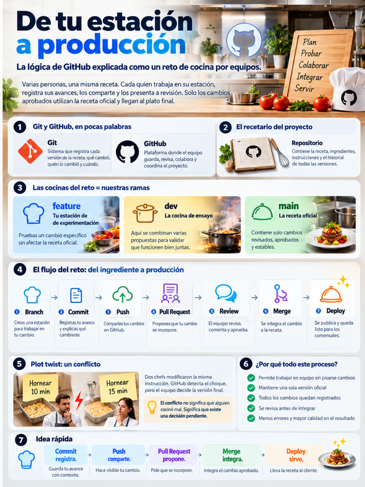
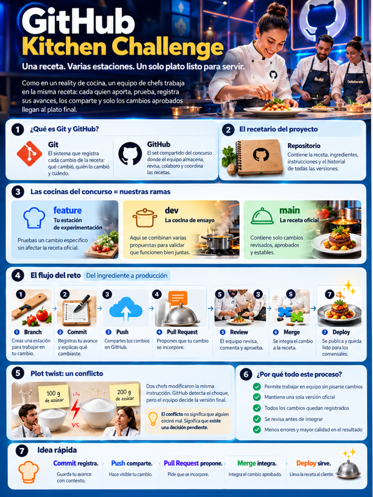

# Resultado final del taller: Contoso Retail

Este repositorio ejecuta de principio a fin las instrucciones del taller y conserva ejemplos reales de ramas personales, colaboración, conflicto, Pull Requests, validaciones y despliegue.

- **Sitio final:** `https://alemcuevas.github.io/resultado-final-taller-github/`
- **Plantilla del taller:** `https://github.com/alemcuevas/github-essentials-workshop`
- **Rama de integración:** `dev`
- **Rama de producción:** `main`

> Este repositorio es el resultado de referencia. Para impartir o realizar el taller, crea un repositorio nuevo desde la plantilla original.

## Material del taller

Este taller presencial de 4 horas te ayuda a entender qué ocurre cuando GitHub Copilot crea archivos y tú ejecutas acciones como `commit`, `push`, `pull` o `merge`. Trabajarás en un solo sitio de retail ficticio y llevarás un cambio desde tu computadora hasta una integración simulada a producción.

## ¿Para quién es?

Para personas de negocio y perfiles técnicos que:

- nunca han usado Git o GitHub, o apenas comienzan;
- ya usan GitHub Copilot para generar código;
- necesitan colaborar sin sobrescribir el trabajo de otras personas;
- quieren entender y resolver bloqueos comunes sin depender siempre de soporte.

No necesitas saber HTML ni CSS. GitHub Copilot escribirá el código; tú practicarás el flujo de Git y GitHub.

## Cómo se organiza el taller

- Trabajarás en un equipo de exactamente dos personas.
- Este repositorio es la **plantilla y ejemplo**; no publicarás aquí tus ejercicios.
- Una persona creará un repositorio nuevo para la pareja mediante **Use this template**.
- Esa persona invitará a su compañero como colaborador.
- Ambos clonarán el repositorio de su equipo y colaborarán únicamente ahí.
- Cada rama incluirá el nombre de quien la crea y la mejora: `feature/nombre-apellido-descripcion`.

Ejemplos:

```text
feature/ana-lopez-catalogo
feature/luis-perez-footer
feature/ana-lopez-mensaje-banner
```

Usa minúsculas, elimina acentos, reemplaza espacios por guiones y no incluyas información distinta de tu nombre y el propósito de la rama.

## Repositorio de ejemplo

- **Plantilla:** `https://github.com/alemcuevas/github-essentials-workshop`
- **Sitio publicado:** `https://alemcuevas.github.io/github-essentials-workshop/`
- **Reglas de colaboración:** [CONTRIBUTING.md](./CONTRIBUTING.md)

El instructor usa este repositorio para demostrar ramas protegidas, validaciones y despliegues. Los participantes sólo lo usan para crear su repositorio con **Use this template** y consultar documentación.

## ¿Qué aprenderás?

- La diferencia entre Git, que registra cambios en tu computadora, y GitHub, que aloja y coordina esos cambios.
- El recorrido `archivo → staging → commit → push → Pull Request → integración`.
- Cómo trabajar con ramas `feature`, `dev` y `main`.
- Cómo colaborar, provocar y resolver un conflicto controlado.
- Cómo abrir, revisar y aprobar un Pull Request.
- Cómo reconocer bloqueos de ramas protegidas, revisiones, conflictos y validaciones.
- Qué tareas puede apoyar Copilot y cuáles siguen siendo tu responsabilidad.

## Prerrequisitos

Completa [SETUP-PREVIO.md](./SETUP-PREVIO.md) antes del taller. Necesitas:

- una cuenta activa de GitHub;
- acceso a GitHub Copilot;
- VS Code con GitHub Copilot y GitHub Pull Requests instalados;
- Git disponible en VS Code;
- acceso al repositorio indicado por el instructor.

No instalarás JavaScript, frameworks, npm ni dependencias. El proyecto usa únicamente HTML y CSS.

## Proyecto continuo

Construirás **Contoso Retail**, una tienda ficticia con:

- encabezado y navegación;
- banner de promociones;
- categorías;
- tarjetas de productos;
- pie de página;
- estilos adaptables con Flexbox y Grid.

El punto de partida está en [proyecto-base/](./proyecto-base/). Al crear el repositorio de tu equipo desde esta plantilla recibirás el mismo contenido. Los módulos agregan cambios al mismo sitio; no son ejercicios separados.

## Agenda exacta

| # | Bloque | Duración | Modalidad |
|---|---|---:|---|
| 1 | Arranque — entorno listo y repositorio creado | 15 min | 5 min concepto + 10 min práctica |
| 2 | Construir, versionar y publicar: commit y push | 30 min | 8 min concepto + 22 min práctica |
| 3 | Ramas de trabajo: feature, dev y main | 30 min | 8 min concepto + 22 min práctica |
| — | Receso | 10 min | — |
| 4 | Colaborar en equipo sobre un mismo proyecto | 30 min | 8 min concepto + 22 min práctica |
| 5 | Conflictos: por qué ocurren y cómo resolverlos | 30 min | 8 min concepto + 22 min práctica |
| — | Receso | 10 min | — |
| 6 | Pull Request, revisión y aprobación del cambio | 30 min | 8 min concepto + 22 min práctica |
| 7 | Despliegue a producción y diagnóstico de fallas | 20 min | 6 min concepto + 14 min práctica |
| 8 | Reto final en equipo, sin acompañamiento | 30 min | 100% práctica |
| 9 | Cierre — recursos y ruta de práctica | 5 min | Cierre |

## Cómo usar este material

Si eres participante, comienza con la [Guía del estudiante](./GUIA-DEL-ESTUDIANTE.md). Ahí encontrarás el recorrido completo del taller en una sola página, con comandos, resultados esperados y puntos de recuperación.

1. Abre el módulo que corresponde al bloque actual.
2. Lee el **Objetivo del bloque** y **Qué vas a lograr aquí**.
3. Sigue **Manos a la obra** en orden; cada paso indica qué debes ver si salió bien.
4. Copia los textos de **Prompt sugerido para Copilot** cuando necesites generar código.
5. No avances hasta completar el **Punto de control**.
6. Si aparece un bloqueo, consulta **Si algo falla** y la [guía de diagnóstico](./recursos/guia-de-diagnostico.md).

## Módulos

1. [Arranque](./modulos/01-arranque.md)
2. [Commit y push](./modulos/02-commit-y-push.md)
3. [Ramas](./modulos/03-ramas.md)
4. [Colaboración](./modulos/04-colaboracion.md)
5. [Conflictos](./modulos/05-conflictos.md)
6. [Pull Request](./modulos/06-pull-request.md)
7. [Despliegue y diagnóstico](./modulos/07-despliegue-y-diagnostico.md)
8. [Reto final](./modulos/08-reto-final.md)

## Si llegaste tarde o te atrasaste

1. Pregunta al instructor en qué módulo y paso está el grupo.
2. Abre ese módulo y revisa **Qué vas a lograr aquí**.
3. Ejecuta `git status` para conocer tu rama y tus cambios pendientes.
4. Si no tienes trabajo pendiente, ejecuta `git pull` en la rama indicada por el instructor.
5. Compara tu pantalla con **Qué debes ver** en el último paso completado por el grupo.
6. Pide apoyo a un mentor antes de copiar comandos que no entiendas.

Puedes continuar aunque no hayas terminado una mejora visual: el objetivo principal es practicar el recorrido del cambio.

## One pagers y créditos

> **Autoría y crédito:** los one pagers **De tu estación a producción** y **GitHub Kitchen Challenge**, así como la idea original de explicar el ciclo de GitHub mediante una cocina colaborativa, fueron creados por **Diana Lira**.

### De tu estación a producción

[](./DE-TU-ESTACION-A-PRODUCCION.PNG)

**Creación e idea original: Diana Lira.**

### GitHub Kitchen Challenge

[](./GITHUB-KITCHEN-CHALLENGE.PNG)

**Creación e idea original: Diana Lira.**

## Referencias rápidas

- [Guía del estudiante](./GUIA-DEL-ESTUDIANTE.md)
- [Reglas de colaboración](./CONTRIBUTING.md)
- [Glosario](./GLOSARIO.md)
- [Ciclo de desarrollo](./CICLO-DE-DESARROLLO.md)
- [Comandos de Git](./recursos/comandos-git.md)
- [Guía de diagnóstico](./recursos/guia-de-diagnostico.md)
- [Prompts para GitHub Copilot](./recursos/prompts-para-copilot.md)

## Regla de seguridad

Nunca subas contraseñas, llaves, tokens, datos personales ni archivos pesados al repositorio. Si Copilot propone algo que no entiendes, pídele que lo explique antes de aceptarlo, revisa el cambio y conserva tú la decisión final.
